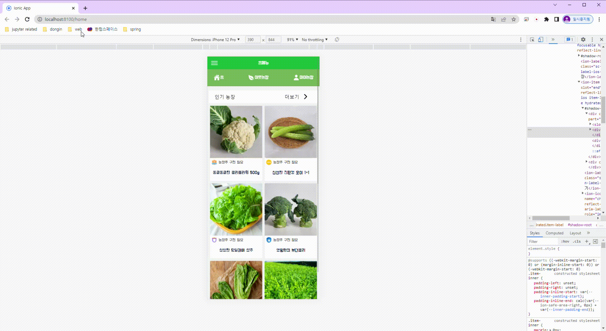
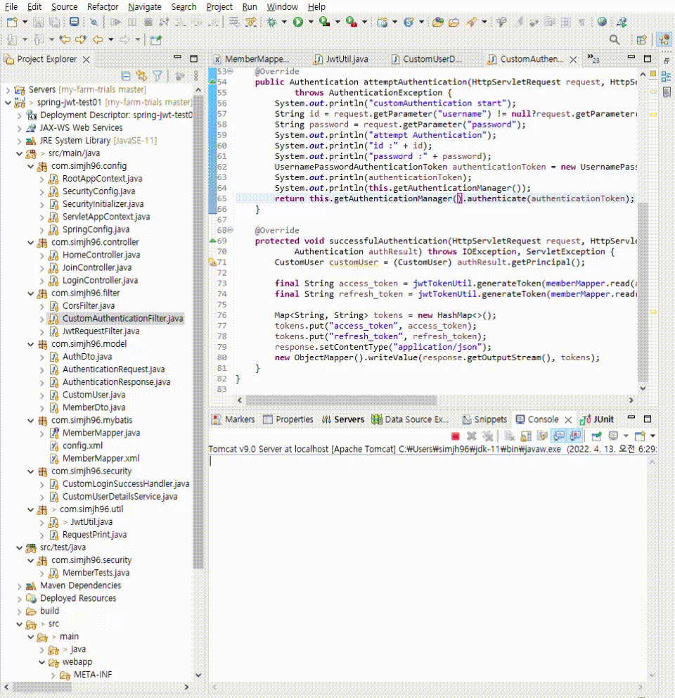

<h1>
  Ionic-Angular 하이브리드 앱개발  
</h1>

#### 해당 repository의 모든 mock image들은 저에게 저작권이 있지 않습니다.

## 1. PWA
- 휴대폰 사이즈로 봐야함
[https://simjh96.github.io/my-farm-trials/home](https://simjh96.github.io/my-farm-trials/home)

## 2. Android

## 3. IOS

- 추후 build 예정

## 4. Angular

- Rxjs로 로그인 및 state 동기화

## 5. Back

- jwt로 stateless backend
- spring mvc + mybatis
- 카카오 로그인 api로 회원가입 완료
- 회원 table + auth table 완료

## 추후 
- firebase로 online?
- 데이터 구조 및 통계량 종류 고민중...
